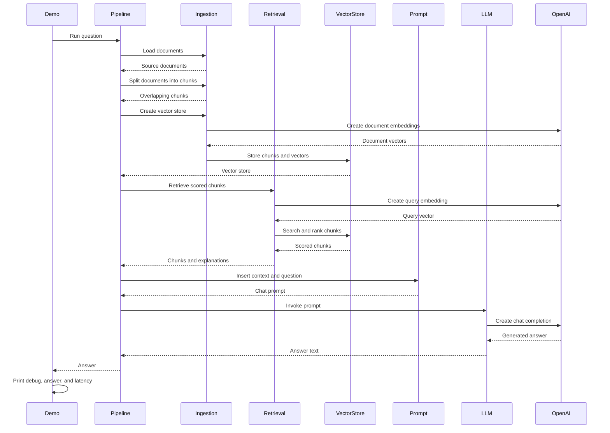

# RAG-langchain

## Project overview

This repository contains a small, educational retrieval-augmented generation (RAG)
implementation for a financial research assistant. The goal is to understand LangChain's
standard RAG abstractions rather than build a production-ready system.

The project shows how the application:

- loads a small synthetic financial corpus
- splits documents into overlapping chunks
- creates OpenAI embeddings and stores them in FAISS
- retrieves and displays the most relevant chunks for a user question
- builds a prompt and generates an investment-style summary with an LLM

This is intended for learning and comparison with the raw-Python, LlamaIndex, and Haystack
implementations in the RAG Framework Familiarisation Sprint.

## RAG sequence

The demo follows this LangChain retrieval-augmented generation flow:



## Installation

This project uses Python 3.13+ and the package manager uv.

1. Install uv if it is not already available.
2. From the repository root, install dependencies:

   ```bash
   uv sync
   ```

3. Create a `.env` file in the project root and add your OpenAI API key:

   ```bash
   OPENAI_API_KEY=your-api-key-here
   ```

## Running the demo

Run the RAG workflow from the project root:

```bash
uv run python main.py
```

The demo displays the sample question and lets you either enter a financial research question
of your own or press Enter to use the sample. It then prints:

- ranked retrieved chunks with relevance scores, source files, source line ranges, and compact
  text previews
- a concise investment-style answer
- total execution latency

## Running tests

Run the offline test suite from the repository root:

```bash
uv run pytest
```

The tests use deterministic local embeddings and do not call the OpenAI API.
